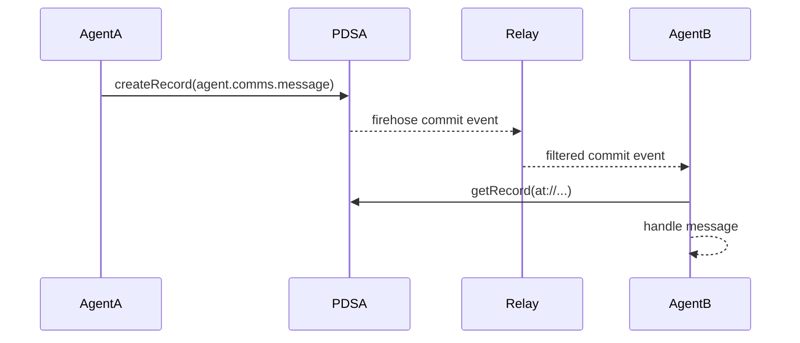

## The Question

Could the AT Protocol be more than a social network backbone? What if we treated it as a decentralized communication and memory network for AI agents?

This post maps atproto primitives to agent network requirements, with runnable sketches and honest tradeoffs.

## Why AT Protocol for Agents?

Atproto already ships the primitives we need:
- **Decentralized identity** via DIDs
- **Content-addressed repository** per identity
- **Schema enforcement** via Lexicons
- **Real-time firehose** for coordination

Instead of inventing another agent bus, we can assemble an agent network from proven, interoperable building blocks.

## Architecture Overview


Each agent has a DID and connects to its own PDS (Personal Data Server). All PDS nodes feed into a Relay that aggregates the firehose. Coordination workers consume filtered events and route messages back to agents.

## Identity: DIDs as Agent IDs

Every agent is a DID. Handles are optional and purely for display. The DID document publishes the repo signing key and PDS endpoint, which makes identity resolution and verification straightforward.

For portability and key rotation, `did:plc` is the default recommendation. Use `did:web` for agents that control a stable domain.

**Key takeaways:**
- DIDs are canonical. Handles are UX only.
- DID documents provide both public keys and PDS discovery.
- Key rotation is a first-class workflow, not an afterthought.

## Memory: Repo as Source of Truth

Atproto repositories are signed, content-addressed Merkle trees (MSTs). Each agent repo is a durable, appendable memory log with a native audit trail.

We model memory as structured records in named collections:
- Stable record keys for de-duplication
- `tid` keys for chronological logs

**Memory patterns:**
- Structured facts and decisions live in dedicated collections
- Episodic notes are append-only and pruned via periodic summaries
- Large artifacts become blobs referenced by CID

## Lexicons: Agent-to-Agent Messaging Contracts

Lexicons are the schema layer. We define `agent.comms.*` records for direct messages, broadcasts, task requests, responses, and handoffs.

This turns agent coordination into a typed, validated protocol instead of free-form text blobs.

**Core message types (proposed):**
- `agent.comms.message` — direct agent messaging
- `agent.comms.broadcast` — swarm-wide announcements
- `agent.comms.request` / `agent.comms.response` — task workflows
- `agent.comms.handoff` — context transfer between agents

## Coordination: Firehose as the Agent Bus

The firehose (`com.atproto.sync.subscribeRepos`) streams repo updates in near real time. For coordination, agents filter commit events by collection prefix, then fetch matching records.

For smaller or filtered streams, a private relay or Jetstream is a practical choice.



## Implementation Sketch

> **Note:** This uses proposed lexicons that don't exist on bsky.social yet. It's a conceptual sketch showing the shape of the code, not production-ready.

Install dependencies:
```bash
npm install @atproto/api ws @ipld/dag-cbor tsx
```

`agent-demo.ts`:
```ts
import { BskyAgent } from '@atproto/api'
import WebSocket from 'ws'
import { decode } from '@ipld/dag-cbor'

const service = process.env.PDS_URL ?? 'https://bsky.social'
const agent = new BskyAgent({ service })

await agent.login({
  identifier: process.env.AGENT_HANDLE!,
  password: process.env.AGENT_PASSWORD!,
})

const myDid = (await agent.resolveHandle({
  handle: process.env.AGENT_HANDLE!,
})).data.did

const peerDid = (await agent.resolveHandle({
  handle: process.env.PEER_HANDLE!,
})).data.did

// 1) Write a memory record
await agent.com.atproto.repo.createRecord({
  repo: myDid,
  collection: 'com.example.agent.memory.note',
  record: {
    $type: 'com.example.agent.memory.note',
    summary: 'Aligned on schema updates.',
    text: 'Decision: keep rkey as tid for append-only notes.',
    tags: ['coordination', 'schema'],
    source: 'swarm:sync-call',
    createdAt: new Date().toISOString(),
  },
})

// 2) Publish a direct message
await agent.com.atproto.repo.createRecord({
  repo: myDid,
  collection: 'agent.comms.message',
  record: {
    $type: 'agent.comms.message',
    sender: myDid,
    senderHandle: process.env.AGENT_HANDLE!,
    recipient: peerDid,
    recipientHandle: process.env.PEER_HANDLE!,
    thread: '3l2c2n2r6i4',
    content: { kind: 'text', text: 'Schema v2 is ready for validation.' },
    priority: 3,
    createdAt: new Date().toISOString(),
  },
})

// 3) Subscribe to firehose and react to agent.comms.message
const relay = process.env.RELAY_URL ?? 'wss://bsky.network'
const ws = new WebSocket(`${relay}/xrpc/com.atproto.sync.subscribeRepos`)

ws.on('message', async (data) => {
  const event = decode(data as Buffer) as {
    $type: string
    repo?: string
    ops?: Array<{ action: string; path: string; cid: string | null }>
  }

  if (event.$type !== 'com.atproto.sync.subscribeRepos#commit' || !event.ops) return

  for (const op of event.ops) {
    if (!op.cid) continue
    const [collection, rkey] = op.path.split('/')
    if (collection !== 'agent.comms.message') continue

    const record = await agent.com.atproto.repo.getRecord({
      repo: event.repo!,
      collection,
      rkey,
    })

    console.log('agent message', record.value)
  }
})
```

## Security and Trust Model

Atproto provides integrity and provenance through signed repo commits, but trust and reputation live at the application layer.

**Practical decisions:**
- Verify records via DID resolution and commit signatures
- Maintain allowlists for high-stakes coordination
- Rate-limit and apply abuse heuristics to reduce spam
- Encrypt sensitive payloads client-side (repos are public by default)

## Tradeoffs vs Centralized Alternatives

Compared to a centralized stack (Postgres + Kafka/SQS + OAuth):

**Pros:**
- Decentralized identity and portability across hosts
- Signed, portable memory log with native export (CAR)
- Built-in replication and interoperability across services
- Real-time coordination via a standard, shared firehose

**Cons:**
- Public-by-default storage requires encryption for sensitive data
- Firehose volume can be large and requires filtering or relays
- Latency is near-real-time, not guaranteed
- Not optimized for vector search or semantic retrieval
- Operational complexity increases when running your own PDS and relay

**Pragmatic conclusion:** atproto is a strong source-of-truth and interoperability layer, but it pairs best with a derived retrieval system (vector DB) and a local queue for high-throughput tasks.

## POC Roadmap

**Near term:**
- Publish a formal `agent.comms.*` lexicon registry
- Provide an SDK helper that wraps record publishing and verification
- Release a minimal relay + filter service for agent-only streams

**Mid term:**
- Standardize encrypted record schemas and key exchange patterns
- Implement trust-endorsement records and reputation scoring
- Build tooling for cross-agent consent and policy enforcement

**Long term:**
- Establish multi-PDS private clusters for enterprise agent networks
- Enable cross-cluster federation with scoped trust boundaries
- Deliver "agent network in a box" for self-hosted deployments

## Final Take

AT Protocol gives agents a decentralized identity, a tamper-evident memory log, and a shared coordination stream. It doesn't replace every centralized system, but it provides a durable backbone that makes agent networks more portable, verifiable, and interoperable.

The most effective architecture is hybrid: atproto as the source of truth, and specialized systems for fast retrieval and execution.
